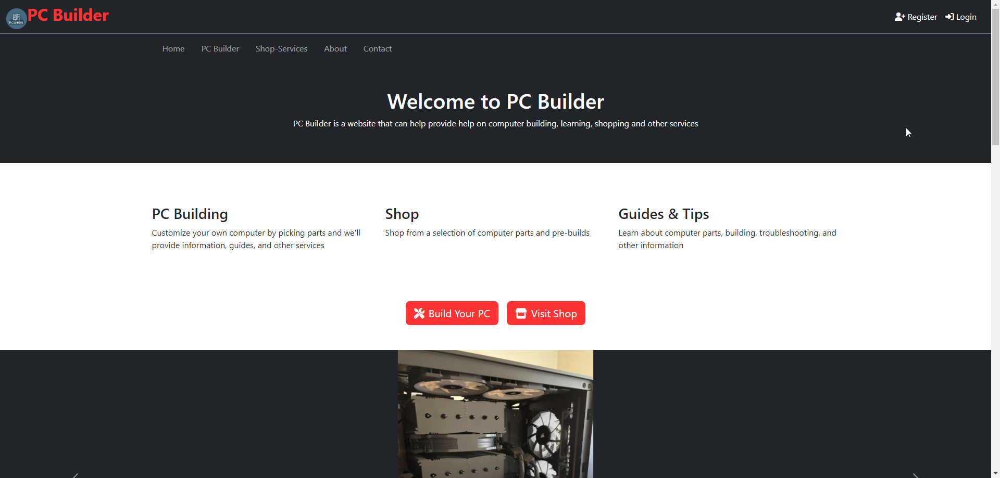
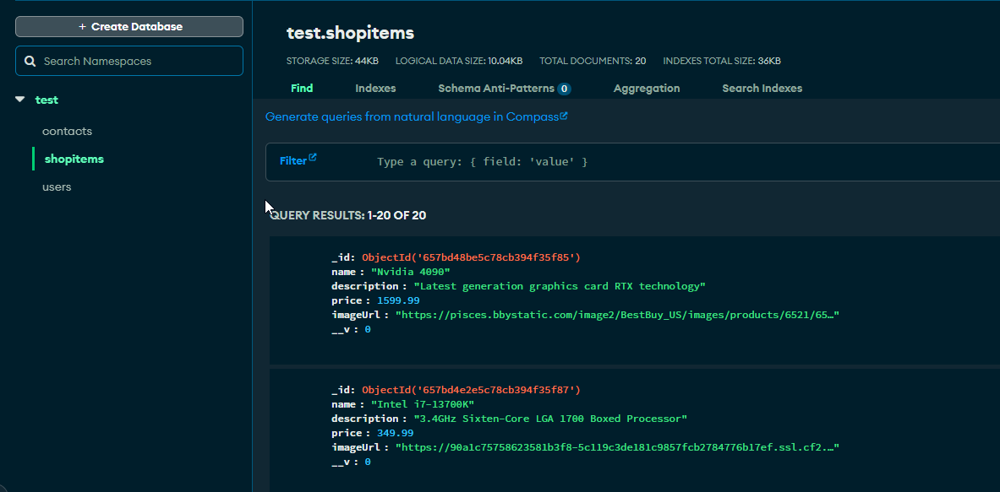
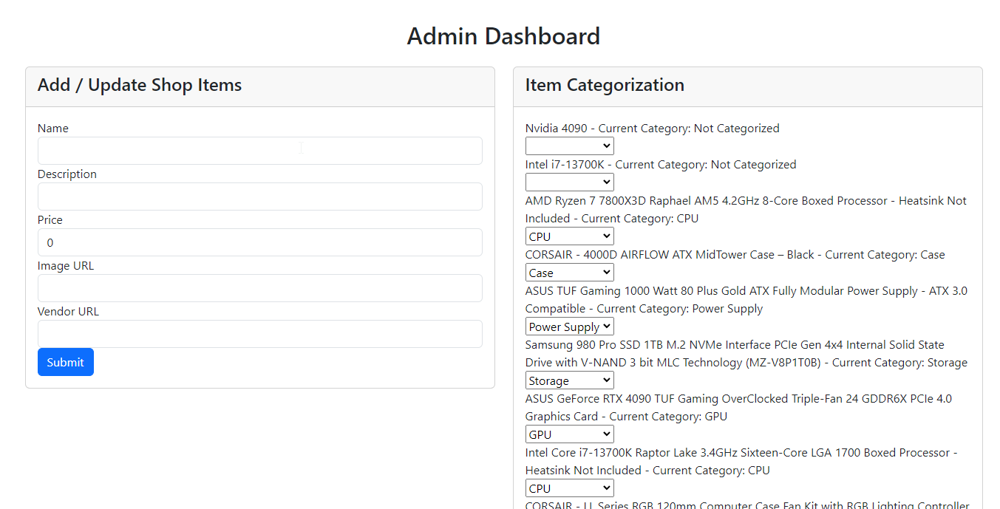
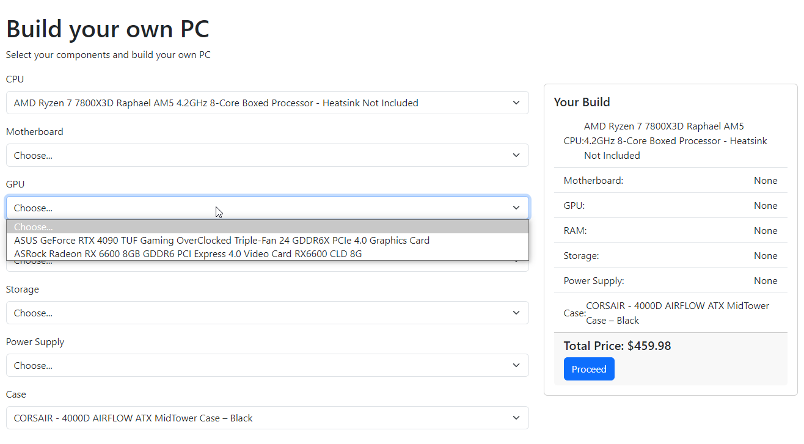
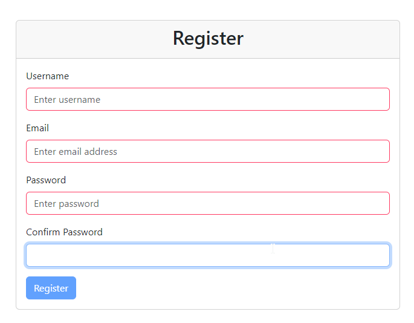
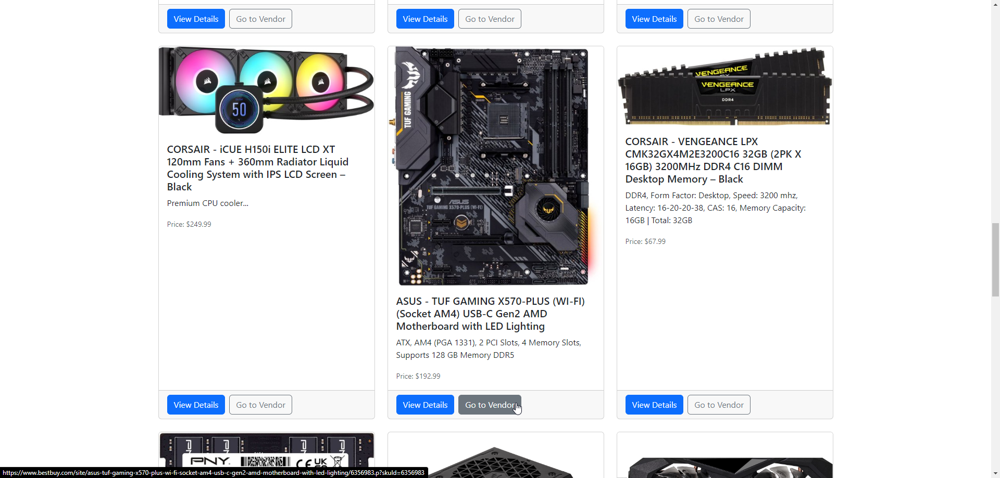

# CSCI675 Build a Full Stack Website Seminar Demo

Cleaned up version for Seminar Demo

## Features

This project is a full stack website based on a simple idea that mirrors my interest for technology and web development and ambitions for building computers. The website utilizes the MEAN stack (MongoDB, Express.js, Angular, and Node.js). I follow the layout of the usual ecommerce website layout with a homepage, shop page, pc builder, contact, and about page. There is also user registration and admin dashboard and populated by the database.

## Setup / How it Works

- pcbuilder is the frontend and the port is 4200 | pcb-backend is the backend and the port is 3000
- Clone the repo using `git clone https://github.com/HernandezA1007/CSCI675-Full-Stack-Website-Demo.git`.
- Navigate to the project directory and install the dependencies: `npm install` in each project.
- Launch the application locally using: `ngx ng serve` or `ng serve` for front-end and `node app.js` for back-end. You need to set up a database such as the MongoDB Atlas I used and create a .env file in the backend. (probably will not work without some of my internal configuration or needs extra set up)
- Access the website by visiting `http://localhost:4200` in your browser.

## My other project location

[https://github.com/HernandezA1007/Full-Stack-Website](https://github.com/HernandezA1007/Full-Stack-Website)

## Gallery

    
    

    
    

